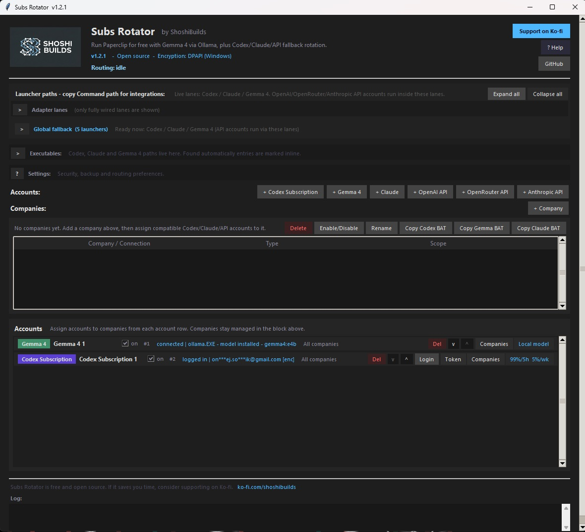
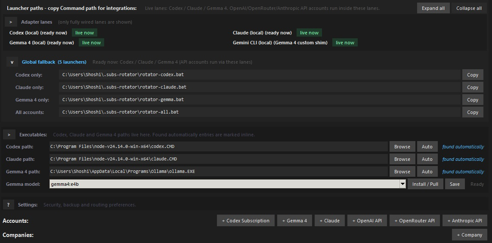
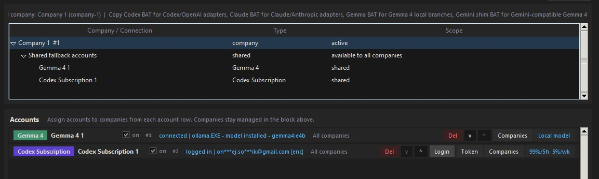
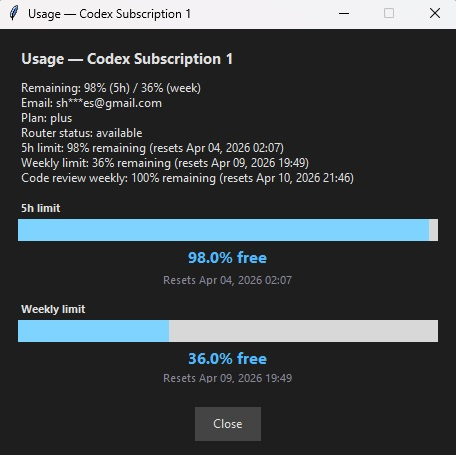
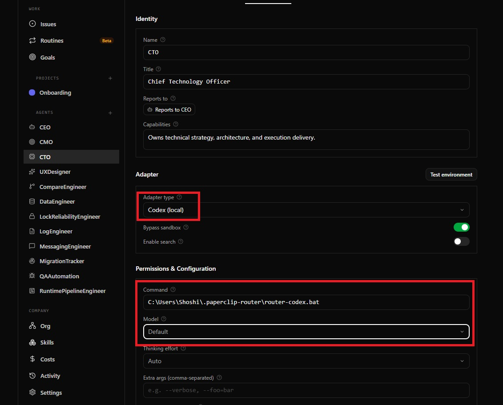

# Subs Rotator

Multi-provider account rotator with automatic failover, cooldown handling, and encrypted local sessions.

Originally built for Paperclip.  
Now usable anywhere the target app can run an external command.

Big win: Gemma 4 runs locally via Ollama, so Paperclip can run for free (or near-zero cost on VPS).

GitHub: https://github.com/shoshibuilds/subs-rotator

## Supported account types

- Codex Subscription
- Claude
- OpenAI API
- OpenRouter API
- Anthropic API
- Gemma 4 (local via Ollama)
- Gemini-compatible Gemma shim

## What it does

Subs Rotator switches to the next eligible account when the current one is:

- rate-limited
- temporarily on cooldown
- exhausted by usage rules
- disabled or not authenticated

This keeps agents running with less manual login/key switching.

For cost-sensitive setups, you can keep Gemma 4 (Ollama) as your always-on base lane and use paid providers only as fallback.

## Beyond Paperclip

You can use Subs Rotator outside Paperclip too.

Practical examples:

- VS Code tasks: call `rotator-codex.bat` instead of direct `codex`.
- Windows Task Scheduler: run `rotator-all.bat` for unattended jobs.
- Custom scripts/tools: execute `rotator-*.bat` as your provider command wrapper.

Requirement: the target app must support launching an external command.

## OpenRouter API support

OpenRouter is supported as a first-class API account type.

- Add account: `+ OpenRouter API`
- Save API key with `Set API key`
- Router runs Codex lane with:
  - `OPENAI_API_KEY=<your_key>`
  - `OPENAI_BASE_URL=https://openrouter.ai/api/v1`
  - `OPENAI_API_BASE=https://openrouter.ai/api/v1`

Usage detail for OpenRouter links to OpenRouter credits/dashboard (instead of 5h/weekly subscription bars).

## Companies and scoped launchers

This build supports company scoping.

- Accounts without company assignment act as global fallback.
- Accounts assigned to companies are available only there.
- Per-company launchers are generated automatically.

## Generated launchers

- `rotator-all.bat`
- `rotator-codex.bat`
- `rotator-claude.bat`
- `rotator-gemma.bat`
- `rotator-gemini.bat`
- plus company-specific launchers under `companies/<slug>/`

## Setup

### Requirements

- Windows
- Python 3.11+
- Codex/Claude CLI where needed
- Ollama for Gemma 4

### Run app

```bash
python rotator_manager.py
```

### Fresh machine bootstrap (optional)

```bash
rotator-bootstrap.bat
```

Bootstrap attempts Python/Node/CLI setup and then starts rotator manager.

## Usage notes

- Codex subscription usage can show 5h + weekly remaining.
- Claude usage depends on available provider signals; plan info fallback is shown when needed.
- OpenRouter/OpenAI/Anthropic API accounts use API-key model and provider billing dashboards.
- Sessions and keys are encrypted locally with Windows DPAPI.

## Screenshots

### Main window
Account list, status, companies, and launcher copying in one place.



### Company groups
Per-company account assignment with dedicated and shared fallback branches.



### Adapter lanes
Live lanes overview and launcher scope hints.



### Usage dialog
Quick remaining usage view (5h + weekly where available).



### Paperclip setup
Example of wiring launcher command into Paperclip agent configuration.



## Files

- `rotator_manager.py` - desktop GUI
- `rotator.py` - runtime router
- `paths.py` - shared paths and executable discovery
- `crypto.py` - encrypted local storage helpers

## Version

Current build line: `v1.2.1`
